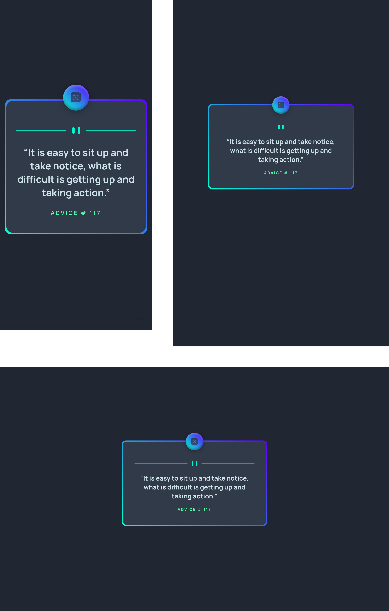

# Frontend Mentor - Advice generator app solution

This is a solution to the [Advice generator app challenge on Frontend Mentor](https://www.frontendmentor.io/challenges/advice-generator-app-QdUG-13db). Frontend Mentor challenges help you improve your coding skills by building realistic projects.

## Table of contents

- [Overview](#overview)
  - [The challenge](#the-challenge)
  - [Screenshot](#screenshot)
  - [Links](#links)
- [My process](#my-process)
  - [Built with](#built-with)
  - [What I learned](#what-i-learned)
  - [Continued development](#continued-development)
  - [Useful resources](#useful-resources)
- [Author](#author)

## Overview

### The challenge

Users should be able to:

- View the optimal layout for the app depending on their device's screen size
- See hover states for all interactive elements on the page
- Generate a new piece of advice by clicking the dice icon
- **Bonus** Use localStorage for save last advice identifier.
- **Bonus** Show advice from last session.

### Screenshot

#### Solution of the challenge view on mobile, tablet and desktop devices

### Links

- [Solution URL](https://github.com/Alejandro25AR/Advice-generator-app)
- [Live Site URL](https://alejandro25ar.github.io/Advice-generator-app/)

## My process

### Built with

- Semantic HTML5 markup
- [React](https://reactjs.org/) - JS library
- [Sass](https://sass-lang.com/) - CSS preprocessor
- Flexbox
- Mobile-first workflow

### What I learned

- I learned to develop a small application with the React library.
  - Create component with functions.
  - Use Hooks
    - useState to control the state of variables in the application
    - useEffect for component lifecycle management
    - useRef to get the reference of elements in the virtual DOM
  - Communication between components
  - Click event handling
  - Syntax of JSX
- I learned how to upload an application developed in React with the gh-pages dependency.
### Continued development

- Continue developing project with JS react library.
- Learn and apply best practices in react.
- Implement an architecture that helps you better understand the applications you develop.

### Useful resources

- Youtube Channel [Jon Mircha](https://www.youtube.com/c/jonmircha) -This is an excellent channel for learning web development.
- [fatal: A branch named 'gh-pages' already exists](https://stackoverflow.com/questions/63964575/fatal-a-branch-named-gh-pages-already-exists) - It helped me to solve the error when uploading the react app to github pages, deleting the address: node_modules/.cache/gh-pages

## Author

- Frontend Mentor - [@Alejandro25AR](https://www.frontendmentor.io/profile/Alejandro25AR)